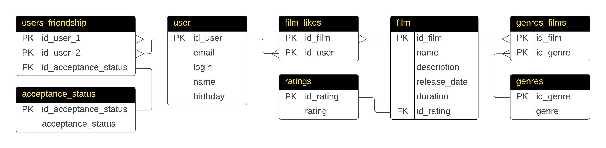

## Описание Базы Данных проекта: "Filmorate"
### user
Содержит информацию о пользователе
+ **(PK)** id_user - идентификатор пользователя
+ email - электронная почта пользователя
+ login - логин пользователя
+ name - имя пользователя
+ birthday - дата рождения пользователя

### users_friendship
Содержит информацию о заявках и статусах дружбы
+ **(PK)** id_user_1 - идентификатор первого пользователя
+ **(PK)** id_user_2 - идентификатор второго пользователя
+ **(FK)** id_acceptance_status *(таблица: acceptance_status)* - идентификатор статуса заявки

### acceptance_status
Содержит перечень статусов 
+ **(PK)** id_acceptance_status - идентификатор статуса заявки
+ acceptance_status - статус заявки

### film
Содержит информацию о фильме
+ **(PK)** id_film - идентификатор фильма 
+ name - название фильма
+ description - описание фильма
+ release_date - дата релиза фильма
+ duration - продолжительность фильма
+ **(FK)** id_rating *(таблица: ratings)* - идентификатор рейтинга фильма

### ratings
Содержит перечень рейтингов
+ **(PK)** id_rating - идентификатор рейтинга
+ rating - рейтинг

### film_likes
Содержит список лайков пользователей 
+ **(PK)** id_film - идентификатор фильма
+ **(PK)** id_user - идентификатор пользователя

### genres_film
Содержит информации о фильмах и их рейтингах
+ **(PK)** id_film - идентификатор фильма
+ **(PK)** id_genre - идентификатор жанра фильма

### genres
Содержит перечень жанров фильмов
+ **(PK)** id_genre - идентификатор жанра
+ genre - жанр

